# SlopLens — Agent Project Dashboard

SlopLens is a local browser dashboard for projects worked on by Codex and Claude Code. It reads their local JSONL history and current project folders. Session transcripts stay local. The optional Jev batch review sends screened, previewed project evidence and structured metrics only when you click **Analyze all**.

For development guidance and release history, see [`AGENTS.md`](AGENTS.md) and the [`plans/` index](plans/README.md). The configured Git remote identifies the private source repository.

## Run on Windows

Requires Node.js 20 or newer and Git on your PATH. From this folder in PowerShell:

```powershell
npm.cmd install
npm.cmd run dev
```

Open **http://127.0.0.1:4380**. The first scan may take around a minute on a large history; progress appears in the UI. Press **Refresh** to rescan after new agent work. `Ctrl+C` stops the local servers.

The dashboard opens in a charcoal dark theme. Use the sun/moon button in the header to switch themes; the choice is saved in this browser. Overview, Review, and project detail use compact headings so the project data appears near the top.

Open **Review** to see a deterministic queue ordered by age multiplied by recorded effort. This is a priority for deciding what to inspect, not a recommendation to keep working. The queue uses the last agent activity, bounded active agent time, token records, and distinct session count. Missing usage can understate effort. Dollar equivalents are displayed for context but never used as a reason to continue.

To enable Jev on Windows, open **Review → Jev API key**, paste your own key, and choose **Save and test key**. The app encrypts it for the Windows account running the server, clears the input, and tests authentication without sending project data. See [API key storage](#api-key-storage) for the exact location and removal behavior. Review shows the number of projects, reusable results, local evidence-gap checks, and maximum new calls. Select a project to expand its **exact base request** and possible **deep request**. Click **Analyze all** once: evidence selection, assessment, citation checks, explanation, and a suggested next move run automatically. No manual scorecard or second assistant is required. Projects without eligible notes are handled locally without a Jev call. Other changed projects use one Jev call; an inconclusive result can use one additional call when more eligible evidence exists. Reanalyze forces a fresh assessment. Deep review is optional.

The package contains recorded time, token categories, model/provider mix, estimated API dollar equivalent, source profile, recent session counts, and aggregate tool categories. It reads top-level `CURRENT_MILESTONE.md`, `PROJECT_STATE.md`, `README.md`, `AGENTS.md`, `BACKLOG.md`, and up to 12 Markdown files in `plans/`. Selection prioritizes current next actions, unfinished acceptance, reported output, and use cases over introductory lines. Headings provide context without consuming excerpt slots; future plans and agent policies cannot support a finish recommendation. Whole lines are privacy-screened before selection, with a 1,200-character maximum per excerpt. Base evidence and section labels are capped at 6,500 characters and 20 excerpts; deep evidence at 16,000 characters and 42 excerpts, including all base excerpts. Omitted and oversized notes are labeled. The app excludes recognized credentials, private paths, session IDs, suspicious instructions, and personal identifiers. Raw session transcripts, source files, tool arguments, and tool outputs stay local. Automated screening cannot identify every private detail in arbitrary prose, so inspect the exact requests before the single batch approval.

The **Needs a decision** order remains age and recorded effort. **Possible leads** requires a checked citation for existing output or a specific use case. Finish candidates come first, then the evidence rating (40% use case, 35% next release, 25% working result); model confidence breaks ties. Jev selects an evidence ID separately for each dimension. Code checks that the ID appeared in the actual request, that citation confidence reaches 0.65, that the note is eligible for that role, and that it was not also selected as a concern. Finish candidates need all three supported dimensions and score confidence of at least 0.65. Uncertainty between adjacent rating levels does not erase a clearly cited fact. The explanation uses fixed language and exact source excerpts; it is not an invented model rationale. A recorded current next action can still be shown when Jev is uncertain. An unchecked task is pending acceptance, not proof that code is absent. The app does not run project tests or verify demand. Expand **Evidence and automatic checks** or **How Jev rated the supplied notes** for details. Confidence is derived from Jev's answer distribution, not independently measured accuracy for this review rubric. Negative suggestions still need a clear, non-negated cited concern.

Results are cached in ignored `.local/portfolio-reviews.json` as scores, IDs, fingerprints, rubric version, usage, and timestamps without source excerpts or explanations. Explanations are reconstructed from the current matching preview. Unchanged results are reused; changes to evidence, metrics, rubric, or review goal invalidate them. This rubric upgrade invalidates older results automatically. If optional deeper analysis fails, the base result remains available and the UI offers **Retry deeper reviews**. Other failures can be retried as a group with **Retry failed projects**. Each remote call may consume TypeSafe credits. [TypeSafe API documentation](https://docs.typesafe.ai/api.md).

**Optional: export for another assistant** retains the copyable brief for a second opinion. It is not part of the normal review workflow and no second API key is required. Inspect its screened excerpts before sharing because arbitrary prose can contain private details.

To discard all cached assessments, stop the local server and delete only `.local/portfolio-reviews.json` in this app's folder. The next Analyze all run will assess every indexed project again.

For a production build:

```powershell
npm.cmd run build
npm.cmd start
```

Open **http://127.0.0.1:4381** for the built version. Only `127.0.0.1` is used.

If another local copy owns port 4381, set `AGENT_DASH_PORT=4382` in the server process before `npm.cmd start`, then open **http://127.0.0.1:4382**. The development Vite proxy still uses the default API port 4381.

## API key storage

| Detail | Behavior |
| --- | --- |
| Where it is saved | `.local/jev-key.dpapi.json` inside this app's folder. The settings panel displays the full path on your machine. |
| Protection at rest | Windows DPAPI with `CurrentUser` scope. The file contains a version, protection label, and encrypted ciphertext. It contains no plain-text API key. |
| Access boundary | Windows protects it for the account running SlopLens. Programs running as that account can also decrypt it. Treat a copied file as tied to that account's Windows profile; re-enter the key on a different account or machine. |
| Browser behavior | The password field is cleared on submission. The app does not save the key in localStorage, sessionStorage, cookies, URLs, or returned settings JSON, and never displays a saved value. |
| Use in memory and transit | The local server decrypts the key in memory when needed and sends it to `api.typesafe.ai` over HTTPS in the authorization header. The password form talks only to the loopback server. |
| Connection test | `GET /v1/models` checks authentication. It sends no project notes or metrics and does not run an assessment. A failed test keeps the encrypted key available for replacement. |
| Replacement | Enter a new key and save. Encryption is verified before an atomic file replacement; encryption failure preserves the previous saved key. |
| Removal | **Remove saved key** deletes only the encrypted local copy. It does not revoke the credential with TypeSafe. Revoke it at TypeSafe to invalidate it everywhere. |
| Configuration priority | Encrypted saved key → server `TYPESAFE_API_KEY` environment variable → app `.env.local`. Removing the saved key restores any existing fallback. The UI identifies the active source. |
| Existing `.env.local` | Still supported and Git ignored, but it is plain text. Saving in the UI does not encrypt or erase an existing copy in that file. Remove that older entry separately if you no longer want a plain-text copy. |
| Other platforms | The password field is disabled when Windows encryption is unavailable. Supply `TYPESAFE_API_KEY` in the server environment; the app never silently falls back to writing a plain-text key. |

The `.local/` folder and `.env.local` are excluded from Git. Key changes and tests require the app's origin and a dedicated request header; settings responses use `Cache-Control: no-store`. Credential input never appears in subprocess arguments or error messages. If a saved key is corrupt or belongs to another Windows account, SlopLens reports the problem and requires replacement or removal instead of silently selecting another account's fallback key. Windows protection is described in [Microsoft's DPAPI documentation](https://learn.microsoft.com/en-us/dotnet/api/system.security.cryptography.protecteddata).

## Jev grading rubric

Jev grades the documentation supplied for each project. Each dimension is scored from **0 to 3**, including fractional values. The graphic shows the current `portfolio-v2-automatic-explanation` rubric; the [questions and classification rules](server/portfolio-review.ts) and [citation checks](src/evidence-quality.ts) are the source of truth.

[](docs/jev-grading-rubric.svg)

*Open the graphic for a larger view. The [editable Mermaid source](docs/jev-grading-rubric.mmd) is included; the README uses a rendered SVG to keep text and connectors consistent in light and dark themes.*

### The three scoring scales

| Score | Use case (U) · 40% | Next release (N) · 35% | Working result (W) · 25% |
| --- | --- | --- | --- |
| **0** | No use case | No concrete release | No demonstrated output |
| **1** | Broad idea or audience | Unclear deliverable or blocker | Prototype or partial workflow |
| **2** | User and useful action | Bounded release and plausible path | End-to-end workflow |
| **3** | Benefit also documented | Verification also stated | Verification or real use case |

### How to read the graphic

- **Citation checks:** The selected excerpt must appear in the actual base or deep request, pass the local eligibility check for that dimension, have citation confidence of at least **0.65**, and not also be selected as a concern. Operating policies and recognized future-plan sections cannot establish existing output; an unchecked task cannot prove completion.
- **Outcome checks:** Finish and deprioritize candidates both require at least **two supplied excerpts** and confidence of at least **0.65 for every rating**. A qualifying explicit negative concern takes precedence. Everything else remains investigate. These confidence thresholds are model signals, not measured probabilities that a project will succeed.
- **Finish candidate:** All three dimensions need checked citations, with scores of **U ≥ 1.8**, **N ≥ 1.8**, and **W ≥ 1.5**, and no explicit negative blocker. **Deprioritize candidate:** An explicit no-value or duplicate blocker needs confidence of at least **0.70** and a clear, non-negated cited concern. Suggestions never automatically archive a project.
- **Possible leads:** A project needs a checked working-result citation with a score of at least **1.5**, or a checked use-case citation with a score of at least **1.8**. Deprioritize candidates are excluded. Finish candidates come first, followed by the evidence rating; the lowest rating confidence breaks ties. An investigate result can still be a possible lead.
- **No eligible notes:** The app handles the evidence gap locally, displays no numeric grade, and makes no Jev call. When a result is inconclusive and more previewed evidence exists, one automatic deep assessment can use it.
- **Separate attention order:** “Needs a decision” uses age × capped recorded effort: **45% active time, 35% tokens, 20% sessions**. Those effort figures and estimated API dollars do not increase the forward evidence rating. See the [attention-order calculation](src/review.ts).

For example, use case **2.4**, next release **2.1**, and working result **2.7** produce an evidence rating of **79/100**. Whether that project becomes a finish candidate still depends on its citations, confidence, and blocker judgment. SlopLens leaves the final decision to the user and never automatically archives a project.

## What the numbers mean

- **Project association:** A session belongs to the working directory recorded by its agent. If that directory is inside a Git repository, SlopLens groups it under the repository root. This indicates work associated with a project, not proof that an agent created it or edited every file there.
- **Last activity / last commit:** The latest local agent event and latest Git commit are separate dates.
- **Source lines:** Nonblank lines in current recognized source and config files. Comments count. Git repositories include tracked and untracked nonignored files. Generated folders, lockfiles, binary files, large files, and unknown file types are excluded. Bounded or inaccessible scans are marked partial; deleted folders retain history but have no current code count.
- **Sessions and tokens:** Unique session IDs per provider and project. Codex cumulative token counters are differenced; repeated Claude message snapshots are deduplicated. Input, cache, and output tokens are separated where records permit. Missing usage is marked, not turned into zero.
- **Time:** Observed active agent time sums bounded Codex tasks and Claude Code requests. Incomplete turns make it a lower bound. Session span runs from the first to the last recorded event and includes idle gaps; it is not human coding time.
- **USD:** A dated API price equivalent for priced model tokens, **not actual billed spend**. Rates are in [`server/pricing.ts`](server/pricing.ts) and came from [OpenAI](https://developers.openai.com/api/docs/pricing) and [Anthropic](https://platform.claude.com/docs/en/about-claude/pricing) public standard rates on September 23, 2026. Subscription fees, discounts, alternate service tiers, tool fees, and unpriced models are outside the estimate. `From` means a partial estimate; `Unpriced` or `Unknown` means no dollar total can be inferred.

The app reads `%USERPROFILE%\.codex\sessions` and `%USERPROFILE%\.claude\projects` by default. For fixture-based testing, override `AGENT_DASH_CODEX_DIR` and `AGENT_DASH_CLAUDE_DIR` before starting the server. Review APIs are `GET /api/review-batch/preview`, `GET /api/review-batch/status`, and same-origin `POST /api/review-batch` with the preview fingerprint and optional project IDs, force, or deep flags. The older unscreened one-project review endpoints are retired.

## Verify

```powershell
npm.cmd run typecheck
npm.cmd test
npm.cmd run build
```

The tests cover both log formats, repeated usage records, unknown prices, missing usage, incomplete timing, source counting in ordinary and Git folders, tool-call deduplication, review ranking, privacy screening, Jev response validation, batch partial success, and cache invalidation.

## Known limits

Windows is the verified platform. Older or unusual log formats may lack usage, tool, or model data. SlopLens does not read billing accounts, remote/cloud agent runs, or other agents. Large project scans are bounded and visibly marked partial. Jev results are structured suggestions, and the portfolio rubric has not been validated against a user-reviewed set of project outcomes.
